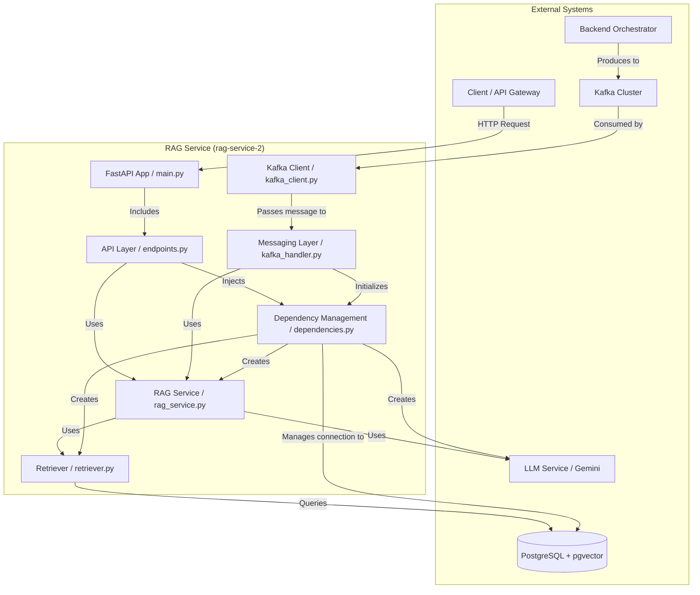

# RAG Service - Architecture Documentation

## 1. Overview

The RAG Service is a self-contained microservice built on Python and FastAPI. Its architecture is designed to support both synchronous and asynchronous operations, making it a flexible component within the broader event-driven system. The core design principles are **Separation of Concerns**, **Dependency Injection**, and **Statelessness**.

## 2. Component Diagram

The following diagram illustrates the internal components of the RAG service and their interactions with external systems.

## 3. Core Components

### 3.1. FastAPI Application (`app/main.py`)
This is the main entry point of the service.
- **Responsibilities**:
  - Initializes the FastAPI application instance.
  - Manages the application lifecycle using the `lifespan` context manager. This is critical for starting and stopping background tasks like the Kafka consumer gracefully.
  - Includes the API router from `endpoints.py` to expose the REST endpoints.
  - Configures middleware, such as `CORSMiddleware`.
  - Sets up application-level logging.

### 3.2. API Layer (`app/api/v1/endpoints.py`)
This layer handles all synchronous HTTP interactions.
- **Responsibilities**:
  - Defines the `/v1/ask` (POST) and `/v1/health` (GET) endpoints.
  - Uses FastAPI's `Depends` system to inject required dependencies (like the retriever and LLM client) into the request handling functions.
  - Orchestrates the RAG pipeline for a single REST request.
  - Serializes the final output using Pydantic models (`Answer`) and handles HTTP exceptions.

### 3.3. Messaging Layer (`app/handlers/kafka_handler.py` & `app/messaging/kafka_client.py`)
This layer manages all asynchronous, event-driven communication.
- **`KafkaClient`**: A dedicated class that abstracts the `confluent-kafka` library. It handles the low-level details of creating producers and consumers, connecting to the cluster, and sending/receiving messages.
- **`KafkaMessageHandler`**: Contains the business logic for processing messages consumed from Kafka.
  - Since it operates outside the FastAPI request-response cycle, it cannot use `Depends`. Instead, its `initialize_dependencies()` method is called at startup to manually create instances of the `PGVectorRetriever` and LLM client.
  - The `handle_message` method acts as a callback for the consumer, parsing the incoming message and routing it to the correct logic based on `task_type`.

### 3.4. Core RAG Logic
This is the central business logic of the service. It is not a single class but a well-defined process that is implemented in both `endpoints.py` (for REST) and `kafka_handler.py` (for Kafka).
- **The Pipeline**:
  1.  **Retrieve**: Use the `PGVectorRetriever` to find relevant document chunks from the database based on the user's query.
  2.  **Format Context**: Concatenate the content of the retrieved documents into a single string to be used as context.
  3.  **Build Prompt**: Create a prompt for the LLM that includes the formatted context and the original user question, instructing the model on how to behave.
  4.  **Generate**: Invoke the LLM with the complete prompt to get a generated answer.
  5.  **Package Response**: Format the final output, including the answer text and the sources of the information.

### 3.5. Retriever (`app/core/retriever.py`)
This component abstracts the interaction with the vector database.
- **Responsibilities**:
  - The `PGVectorRetriever` class wraps the `langchain_community.vectorstores.pgvector.PGVector` instance.
  - It provides a clean `retrieve()` method, hiding the implementation details of whether the search is a `similarity_search` or `mmr` search.

### 3.6. Data and Dependency Management
- **`app/core/dependencies.py`**: A crucial file for the REST API. It defines functions that create and yield shared resources like database sessions, the embedding model, the LLM client, and the retriever. FastAPI's dependency injection system calls these functions for each request.
- **`app/core/config.py`**: Uses Pydantic's `BaseSettings` to load all configuration from environment variables, ensuring the service is configurable without code changes.
- **`app/models/`**: This directory contains all Pydantic and SQLAlchemy models, defining the data structures for API requests/responses (`rag.py`), Kafka messages (`kafka_messages.py`), and the database schema (`document_chunks.py`).