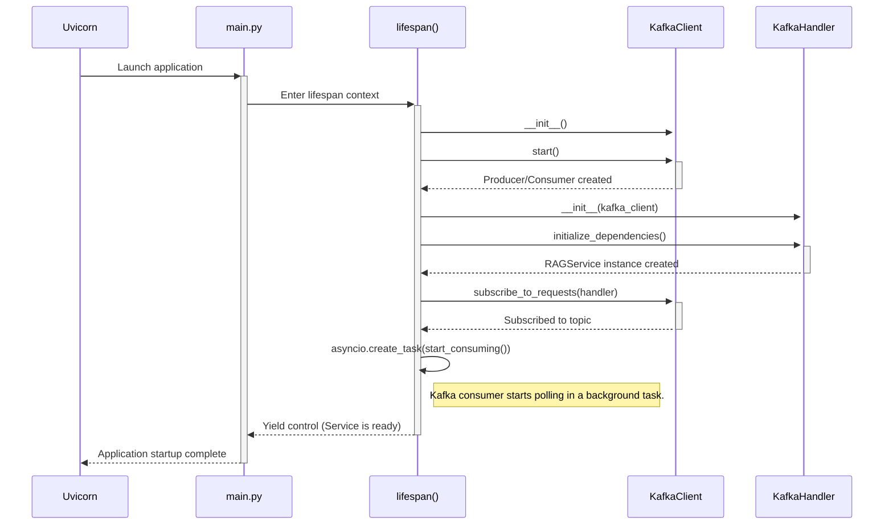

# RAG Service - Workflow Documentation

This document details the primary operational workflows of the RAG Service, from startup to processing both synchronous and asynchronous requests.

## 1. Service Startup and Initialization Workflow

This workflow describes the sequence of events when the service is launched.

**Steps:**
1.  The Uvicorn server starts the FastAPI application defined in `app/main.py`.
2.  The `lifespan` async context manager is entered.
3.  An instance of `KafkaClient` is created, and its `start()` method initializes the Kafka producer and consumer.
4.  An instance of `KafkaMessageHandler` is created, receiving the `KafkaClient` instance.
5.  The handler's `initialize_dependencies()` method is called, which manually creates an instance of the `RAGService` for asynchronous processing.
6.  The Kafka consumer is subscribed to the request topic, with `handle_message` as the callback.
7.  A background `asyncio` task is created to run the `kafka_client.start_consuming()` loop, which continuously polls Kafka for new messages.
8.  The service is now fully operational and can handle both REST and Kafka requests.

## 2. Synchronous REST API Workflow

This flow is triggered by an HTTP POST request to the `/v1/ask` endpoint. The sequence diagram for this is available in `readme.md`.

**Steps:**
1.  A client sends a POST request with a JSON body (e.g., `{"text": "What are the visiting hours?"}`) to `/v1/ask`.
2.  FastAPI routes the request to the `ask_question` function in `app/api/v1/endpoints.py`.
3.  FastAPI's dependency injection system calls `get_rag_service` to provide a fully configured `RAGService` instance for the request.
4.  The endpoint calls the `rag_service.ask(question)` method.
5.  The `RAGService` executes the full RAG pipeline (retrieve, format, generate) and returns a `RAGResult` object.
6.  The endpoint converts the `RAGResult` into an `Answer` Pydantic model and returns it to the client as a JSON response with a `200 OK` status.

## 3. Asynchronous Kafka Workflow

This flow is triggered when the Backend Orchestrator sends a message to the `general-info-requests` Kafka topic. The sequence diagram is available in `readme.md`.

**Steps:**
1.  The background consumer task, running since startup, polls and receives a `TaskRequest` message from the Kafka topic.
2.  The message is passed to the `KafkaMessageHandler.handle_message` method.
3.  The JSON message is parsed and validated using the `TaskRequest` Pydantic model. The `correlation_id` is extracted for tracking.
4.  Based on the `task_type` ("general_info"), the message is routed to the `_handle_general_info_request` method.
8.  The `KafkaClient` serializes a `TaskResponse` model (containing the `correlation_id`, a "SUCCESS" status, and the result) into JSON.
9.  The producer sends this `TaskResponse` message to the `general-info-responses` topic. The Backend Orchestrator listens on this topic to receive the result and continue its workflow.

## 4. Error Handling Workflows

### REST API Error Handling

- **Process**: The `ask_question` function is wrapped in a `try...except` block.
- **Outcome**: If any exception occurs during the RAG pipeline (e.g., database connection error, LLM API failure), the `except` block catches it.
- **Action**: A `fastapi.HTTPException` is raised with a `500 Internal Server Error` status code and a generic error detail string. FastAPI automatically converts this into a standard JSON error response for the client.

### Kafka Message Error Handling

- **Process**: The `handle_message` and `_handle_general_info_request` methods are wrapped in `try...except` blocks.
- **Outcome**: If an exception occurs, it is caught.
- **Action**: The `_send_error_response` method is called. This method constructs a `TaskResponse` message with:
  - The original `correlation_id`.
  - `status="ERROR"`.
  - A `result` payload containing a user-friendly error message and a `requires_human_handoff: true` flag.
- This structured error response allows the Backend Orchestrator to know that the task failed and that it may need to take alternative actions, such as escalating to a human agent.