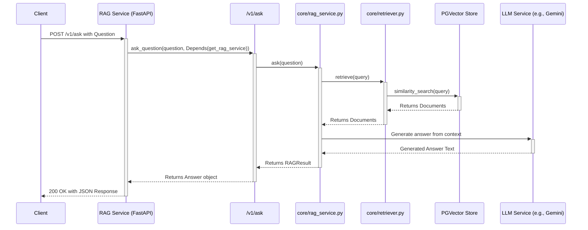
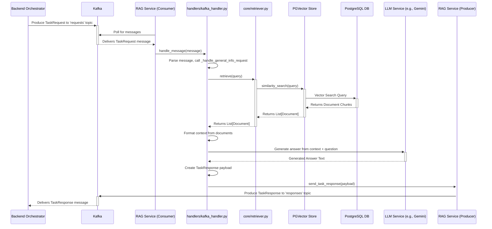

# RAG Service (rag-service-2)

## Service Overview

The `rag-service-2` is a specialized microservice designed for **Retrieval Augmented Generation (RAG)**. Its core responsibility is to answer user questions by first retrieving relevant information from an internal knowledge base (a PostgreSQL database with `pgvector`) and then using a Large Language Model (LLM) to generate a fact-based answer from the retrieved context. This RAG service agent also acts as the general info agent for PV Chatbot General.

The service exposes its functionality through two primary interfaces:

1.  **Synchronous REST API**: A standard HTTP endpoint (`/v1/ask`) for direct, request-response interactions.
2.  **Asynchronous Messaging**: A Kafka consumer/producer for integration into a decoupled, event-driven workflow, typically orchestrated by a central service like the `backend_orchestrator`.

## Request Flows

### 1. REST API Request Flow

This diagram illustrates the sequence of events for a synchronous request made to the `/v1/ask` endpoint.



### 2. Kafka-Based Request Flow

This diagram illustrates the asynchronous, event-driven flow where the service consumes a request from a Kafka topic and produces a response to another topic.



## Setup and Running

### Local Development
python3 -m venv .venv
source .venv/bin/activate
1.  **Install dependencies:**
    ```bash
    poetry install
    ```

2.  **Run the service (ensure `.env` is configured):**
    ```bash
    poetry run uvicorn app.main:app --host 0.0.0.0 --port 8002 --reload
    ```


RAG Service (rag-service-2) Documentation
Service Overview
The rag-service-2 is a specialized microservice designed for Retrieval Augmented Generation (RAG). Its core responsibility is to answer user questions by first retrieving relevant information from an internal knowledge base and then using a Large Language Model (LLM) to generate a concise, fact-based answer from the retrieved context.

This service is architected to be a key component in a larger, event-driven system. It exposes its functionality through two primary interfaces:

Synchronous REST API: A standard HTTP endpoint (/v1/ask) for direct, request-response interactions.
Asynchronous Messaging: A Kafka consumer/producer for integration into a decoupled, message-based workflow, likely orchestrated by a central service (e.g., backend_orchestrator).
The service leverages a PostgreSQL database with the pgvector extension to store and perform efficient similarity searches on document embeddings, which is the "retrieval" part of RAG.


poetry new rag-service

docker build -t pjt/rag-service:latest .

    docker pull registry:2
    docker run -d -p 5000:5000 --restart always --name registry registry:2

docker build -t pjt/rag-service:latest .
docker tag pjt/rag-service:latest localhost:5000/pjt/rag-service:latest
docker push localhost:5000/pjt/rag-service:latest

docker build -t pjt/rag-service:v1.0.0 .
docker tag pjt/rag-service:v1.0.0 localhost:5000/pjt/rag-service:v1.0.0
docker push localhost:5000/pjt/rag-service:v1.0.0

poetry run uvicorn app.main:app --host 0.0.0.0 --port 8000 --reload
