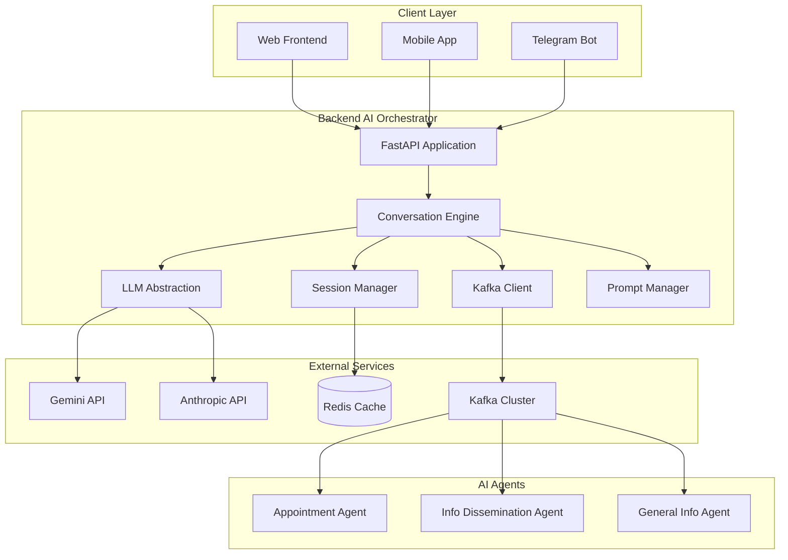
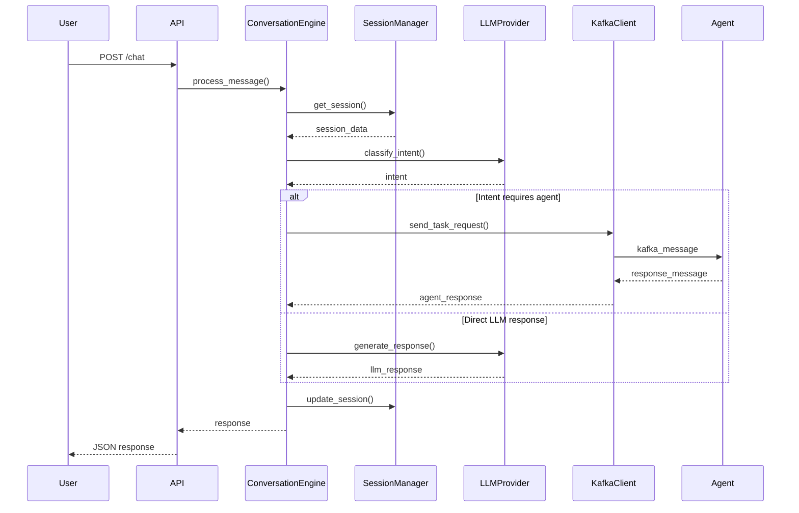
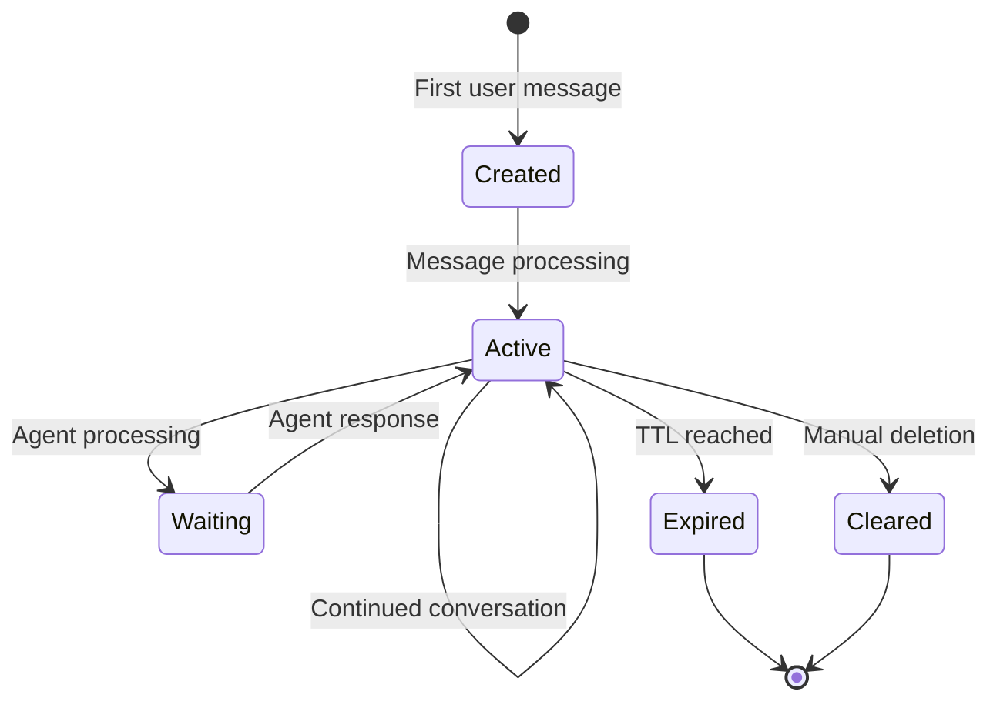
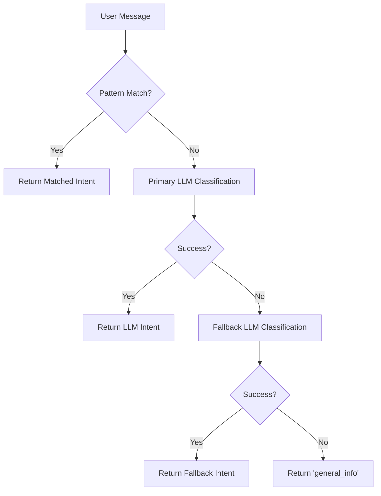

# Backend AI Orchestrator - Architecture Documentation

## System Overview

The Backend AI Orchestrator serves as the central nervous system of the healthcare chatbot platform, coordinating interactions between users, AI agents, and external systems. It implements a microservices architecture with event-driven communication patterns.

## Architectural Principles

### 1. Separation of Concerns
- **Presentation Layer**: FastAPI endpoints for external communication
- **Business Logic Layer**: Conversation engine and workflow management
- **Data Layer**: Session management and state persistence
- **Integration Layer**: LLM providers and agent communication

### 2. Provider Abstraction
- LLM providers are abstracted behind a common interface
- Easy switching between providers (Gemini, Anthropic, future local models)
- Automatic failover and load balancing capabilities

### 3. Event-Driven Architecture
- Asynchronous communication via Kafka
- Loose coupling between orchestrator and specialized agents
- Scalable message processing with correlation tracking

### 4. Stateful Session Management
- Redis-based session persistence
- Conversation history and context preservation
- Configurable session lifecycle management

## Component Architecture



## Core Components

### 1. FastAPI Application (`src/main.py`)

**Responsibilities:**
- HTTP request/response handling
- Input validation and serialization
- Error handling and logging
- Health check endpoints
- Metrics collection

**Key Features:**
- Pydantic models for request/response validation
- Async request handling
- Structured error responses
- CORS support for web clients

**Endpoints:**
- `POST /chat` - Main conversation endpoint
- `GET /health` - Service health check
- `GET /session/{id}` - Session retrieval
- `DELETE /session/{id}` - Session cleanup
- `GET /metrics` - Service metrics

### 2. Conversation Engine (`src/workflow/conversation_engine.py`)

**Responsibilities:**
- Intent classification and routing
- Multi-turn conversation management
- Agent coordination and response synthesis
- Emergency detection and escalation

**Key Features:**
- Pattern-based and LLM-based intent classification
- Automatic fallback between LLM providers
- Correlation-based agent communication
- Context-aware response generation

**Intent Classification Flow:**
1. Pattern matching against predefined keywords
2. LLM-based classification if no pattern match
3. Fallback LLM provider if primary fails
4. Default to `general_info` if all methods fail

### 3. LLM Abstraction Layer (`src/llm_abstraction/`)

**Components:**
- `provider_interface.py` - Common interface definition
- `gemini_provider.py` - Google Gemini implementation
- `anthropic_provider.py` - Anthropic Claude implementation
- `prompt_manager.py` - External prompt template management

**Key Features:**
- Provider-agnostic request/response handling
- Automatic retry logic with exponential backoff
- Usage tracking and cost monitoring
- Health check capabilities

**Provider Interface:**
```python
class LLMProviderInterface:
    async def generate_response(self, request: LLMRequest) -> LLMResponse
    async def health_check(self) -> bool
    def get_provider_name(self) -> str
    def get_supported_models(self) -> List[str]
```

### 4. Session Manager (`src/session/session_manager.py`)

**Responsibilities:**
- Session lifecycle management
- Conversation history persistence
- User context storage
- Session cleanup and expiration

**Key Features:**
- Redis-based storage with TTL
- Conversation history truncation (max 50 messages)
- User session tracking
- Automatic cleanup of expired sessions

**Session Data Structure:**
```json
{
  "session_id": "uuid",
  "user_id": "string",
  "created_at": "timestamp",
  "last_activity": "timestamp",
  "conversation_history": [
    {
      "timestamp": "timestamp",
      "role": "user|assistant|system",
      "content": "string",
      "metadata": {}
    }
  ],
  "context": {},
  "current_intent": "string",
  "workflow_state": "string",
  "pending_tasks": []
}
```

### 5. Kafka Client (`src/messaging/kafka_client.py`)

**Responsibilities:**
- Agent-to-Agent (A2A) communication
- Message correlation and tracking
- Async message processing
- Error handling and retry logic

**Key Features:**
- Correlation ID-based request/response matching
- Topic-based agent routing
- Async message consumption
- Dead letter queue support

**Message Format:**
```json
{
  "message_type": "TASK_REQUEST|TASK_RESPONSE",
  "correlation_id": "uuid",
  "timestamp": "iso8601",
  "task_type": "string",
  "payload": {},
  "status": "SUCCESS|ERROR|TIMEOUT",
  "error": "string"
}
```

## Data Flow

### 1. User Message Processing



### 2. Session Lifecycle



### 3. Intent Classification Decision Tree



## Configuration Management

### 1. Environment-Based Configuration

```python
class Settings(BaseSettings):
    # LLM Configuration
    gemini_api_key: str
    anthropic_api_key: str
    default_llm_provider: str = "gemini"
    fallback_llm_provider: str = "anthropic"
    
    # Infrastructure
    database_url: str
    redis_url: str
    kafka_bootstrap_servers: str
    
    # Service Configuration
    log_level: str = "INFO"
    session_ttl: int = 3600
    max_conversation_length: int = 50
```

### 2. YAML-Based Configuration

**LLM Configuration (`config/llm_config.yaml`):**
- Provider-specific settings
- Model parameters
- Retry and timeout configurations
- Emergency detection keywords

**Orchestration Rules (`config/orchestration_rules.yaml`):**
- Agent routing configuration
- Workflow definitions
- Human handoff triggers
- Rate limiting settings

## Error Handling Strategy

### 1. Error Categories

**Recoverable Errors:**
- LLM provider timeouts → Fallback provider
- Agent timeouts → Human handoff option
- Session corruption → Create new session

**Non-Recoverable Errors:**
- Invalid API keys → Service startup failure
- Database connectivity → Service degradation
- Critical system errors → Emergency escalation

### 2. Error Response Format

```json
{
  "detail": "Human-readable error message",
  "error_code": "MACHINE_READABLE_CODE",
  "timestamp": "2024-01-15T10:30:00Z",
  "correlation_id": "uuid",
  "retry_after": 30
}
```

### 3. Circuit Breaker Pattern

```python
class CircuitBreaker:
    def __init__(self, failure_threshold=5, timeout=60):
        self.failure_threshold = failure_threshold
        self.timeout = timeout
        self.failure_count = 0
        self.last_failure_time = None
        self.state = "CLOSED"  # CLOSED, OPEN, HALF_OPEN
```

## Security Architecture

### 1. Authentication & Authorization

**Current Implementation:**
- Simple user:db authentication
- Session-based user tracking
- Input validation via Pydantic

**Future Implementation:**
- Google Workspace integration
- Role-based access control (RBAC)
- JWT token authentication

### 2. Data Protection

**In Transit:**
- HTTPS for all API communications
- TLS for Kafka communications
- Encrypted Redis connections

**At Rest:**
- Encrypted session data in Redis
- Secure API key storage
- Audit logging for compliance

### 3. Input Validation

```python
class ChatRequest(BaseModel):
    user_id: str = Field(..., min_length=1, max_length=100)
    message: str = Field(..., min_length=1, max_length=2000)
    session_id: Optional[str] = Field(None, regex=UUID_REGEX)
    context: Optional[Dict[str, Any]] = Field(default_factory=dict)
```

## Performance Considerations

### 1. Caching Strategy

**Session Caching:**
- Redis with configurable TTL
- LRU eviction policy
- Session data compression

**Response Caching:**
- Common query response caching
- Intent classification result caching
- Prompt template caching

### 2. Async Processing

**FastAPI Async Endpoints:**
- Non-blocking I/O operations
- Concurrent request handling
- Connection pooling

**Kafka Async Processing:**
- Async message production/consumption
- Batch message processing
- Backpressure handling

### 3. Resource Management

**Connection Pooling:**
- Redis connection pool
- Kafka producer/consumer pools
- HTTP client connection reuse

**Memory Management:**
- Conversation history truncation
- Session cleanup scheduling
- Garbage collection optimization

## Monitoring & Observability

### 1. Logging Strategy

**Structured Logging:**
```python
logger.info(
    "Message processed",
    user_id=user_id,
    session_id=session_id,
    intent=intent,
    processing_time_ms=processing_time,
    llm_provider=provider_name
)
```

**Log Levels:**
- `DEBUG`: Detailed execution flow
- `INFO`: Normal operations
- `WARNING`: Recoverable errors
- `ERROR`: Service errors
- `CRITICAL`: Emergency situations

### 2. Metrics Collection

**Business Metrics:**
- Messages processed per minute
- Intent classification accuracy
- Session duration statistics
- User engagement metrics

**Technical Metrics:**
- Response time percentiles
- Error rates by component
- Resource utilization
- Cache hit rates

### 3. Health Checks

**Service Health:**
- Database connectivity
- Redis availability
- Kafka cluster status
- LLM provider health

**Dependency Health:**
- External API response times
- Queue depth monitoring
- Resource threshold alerts

## Scalability Design

### 1. Horizontal Scaling

**Stateless Design:**
- Session state externalized to Redis
- No local state in application instances
- Load balancer compatible

**Kafka Partitioning:**
- User-based message partitioning
- Parallel agent processing
- Consumer group scaling

### 2. Vertical Scaling

**Resource Optimization:**
- Memory-efficient session storage
- CPU-optimized intent classification
- I/O optimization for database operations

### 3. Auto-Scaling Triggers

**Scale-Out Conditions:**
- CPU utilization > 70%
- Memory utilization > 80%
- Response time > 2 seconds
- Queue depth > 1000 messages

**Scale-In Conditions:**
- CPU utilization < 30%
- Memory utilization < 50%
- Response time < 500ms
- Queue depth < 100 messages

## Future Architecture Enhancements

### 1. Multi-Region Deployment

**Global Load Balancing:**
- Geographic request routing
- Regional failover capabilities
- Data residency compliance

**Cross-Region Replication:**
- Session data synchronization
- Configuration replication
- Disaster recovery planning

### 2. Advanced AI Capabilities

**Local LLM Support:**
- On-premises model deployment
- Custom model fine-tuning
- Privacy-preserving inference

**Multi-Modal Support:**
- Voice message processing
- Image analysis capabilities
- Document understanding

### 3. Enhanced Integration

**EHR Integration:**
- Real-time patient data access
- Appointment system integration
- Clinical decision support

**Communication Channels:**
- WhatsApp Business API
- Microsoft Teams integration
- Slack workspace support
