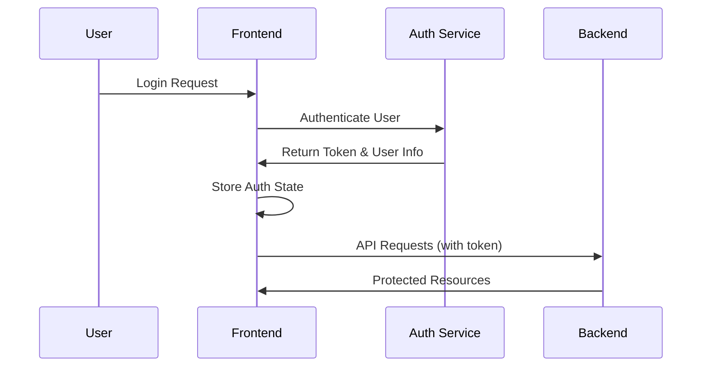

# Frontend API Reference

## Overview

The PV Chatbot Frontend is a React/TypeScript application that provides a healthcare-focused conversational AI interface. It integrates with the Backend Orchestrator and Authentication Service to deliver a complete chatbot experience for both patients and healthcare staff.

## Architecture

### Technology Stack

- **Framework**: React 18 with TypeScript
- **Build Tool**: Vite 6.3.5
- **Styling**: Tailwind CSS with shadcn/ui components
- **Routing**: React Router DOM
- **HTTP Client**: Axios
- **State Management**: React Context API
- **Date Handling**: date-fns

### Project Structure

```
frontend/
├── src/
│   ├── auth/                    # Authentication system
│   │   └── AuthContext.tsx      # Auth state management
│   ├── components/
│   │   ├── auth/               # Authentication components
│   │   │   ├── LoginPage.tsx   # Login interface
│   │   │   └── ProtectedRoute.tsx # Route protection
│   │   ├── chat/               # Chat interface components
│   │   │   ├── ChatLayout.tsx  # Main chat container
│   │   │   ├── ChatSidebar.tsx # Session history sidebar
│   │   │   └── ChatArea.tsx    # Message interface
│   │   ├── admin/              # Admin dashboard
│   │   │   └── AdminDashboard.tsx
│   │   └── ui/                 # Reusable UI components
│   ├── services/
│   │   └── api.ts              # API service layer
│   ├── types/
│   │   ├── api.ts              # API type definitions
│   │   └── auth.ts             # Auth type definitions
│   └── lib/
│       └── utils.ts            # Utility functions
├── public/                     # Static assets
├── .env                        # Environment variables
└── package.json               # Dependencies and scripts
```

## API Integration

### Backend Orchestrator Integration

The frontend integrates with the Backend Orchestrator API running on `http://backend-orchestrator.general-chatbot-app.svc.cluster.local:8000` in Kubernetes or `http://localhost:8000` for local development.

#### Endpoints Used

| Endpoint | Method | Purpose | Component |
|----------|--------|---------|-----------|
| `/chat` | POST | Send chat messages | ChatArea |
| `/session/{id}` | GET | Retrieve session data | ChatLayout |
| `/metrics` | GET | System metrics | AdminDashboard |
| `/health` | GET | Health check | AdminDashboard |

#### API Service Implementation

```typescript
// src/services/api.ts
class ApiService {
  private backendApi: AxiosInstance;
  private authApi: AxiosInstance;

  constructor() {
    this.backendApi = axios.create({
      baseURL: import.meta.env.VITE_BACKEND_URL || 'http://localhost:8000',
      timeout: 30000,
    });

    this.authApi = axios.create({
      baseURL: import.meta.env.VITE_AUTH_URL || 'http://localhost:8004',
      timeout: 10000,
    });

    // Request interceptors for authentication
    this.setupInterceptors();
  }
}
```

### Authentication Service Integration

The frontend is designed to integrate with the Authentication Service on `http://localhost:8004`.

#### Current Implementation

- **Dummy Authentication**: Always succeeds for development/testing
- **Modular Design**: Ready for Google Workspace, Entra, AWS Cognito, or internal DB integration
- **Role-Based Access**: Supports patient, staff, and admin roles

#### Authentication Flow



## Data Types and Interfaces

### Core Types

```typescript
// User representation
interface User {
  id: string;
  email: string;
  name: string;
  role: 'patient' | 'staff' | 'admin';
  department?: string;
}

// Chat request format
interface ChatRequest {
  user_id: string;
  message: string;
  session_id?: string;
  context?: {
    language?: 'en' | 'id';
    user_type?: 'patient' | 'staff';
    department?: string;
    priority?: 'low' | 'normal' | 'high';
  };
}

// Chat response format
interface ChatResponse {
  response: string;
  session_id: string;
  intent: string;
  requires_human_handoff: boolean;
  suggested_actions: string[];
  confidence_score: number;
  processing_time_ms: number;
}
```

### Session Management

```typescript
interface SessionData {
  session_id: string;
  user_id: string;
  created_at: string;
  last_activity: string;
  conversation_history: ConversationMessage[];
  context: {
    language: string;
    current_intent?: string;
    workflow_state?: string;
  };
  pending_tasks: Array<{
    task_id: string;
    task_type: string;
    status: 'pending' | 'processing' | 'completed' | 'failed';
    created_at: string;
  }>;
}
```

## Component API

### Authentication Components

#### AuthContext

Provides authentication state management across the application.

```typescript
interface AuthState {
  isAuthenticated: boolean;
  user: User | null;
  token: string | null;
}

interface AuthContextType {
  authState: AuthState;
  login: (email: string, password: string) => Promise<void>;
  logout: () => void;
}
```

**Usage:**
```typescript
const { authState, login, logout } = useAuth();
```

#### LoginPage

Renders the login interface with dummy authentication.

**Props:** None

**Features:**
- Email/password form
- Demo login buttons (Patient/Admin)
- Healthcare branding
- Responsive design

#### ProtectedRoute

Wraps components that require authentication.

```typescript
interface ProtectedRouteProps {
  children: React.ReactNode;
  requiredRole?: 'patient' | 'staff' | 'admin';
}
```

### Chat Components

#### ChatLayout

Main container for the chat interface.

**Props:** None

**Features:**
- Manages session state
- Handles session selection
- Coordinates sidebar and chat area

#### ChatSidebar

Displays user info and conversation history.

```typescript
interface ChatSidebarProps {
  sessions: SessionData[];
  currentSessionId: string | null;
  onNewChat: () => void;
  onSelectSession: (sessionId: string) => void;
  loading: boolean;
}
```

#### ChatArea

Message interface for sending and displaying messages.

```typescript
interface ChatAreaProps {
  session: SessionData | null;
  userId: string;
  onSessionUpdate: (session: SessionData) => void;
  loading: boolean;
}
```

### Admin Components

#### AdminDashboard

System monitoring and analytics interface.

**Props:** None

**Features:**
- Real-time metrics display
- Health status monitoring
- Error rate tracking
- Intent distribution charts
- Refresh functionality

## Error Handling

### API Error Handling

```typescript
// Standardized error response
interface ApiError {
  detail: string;
  error_code?: string;
  timestamp?: string;
}

// Error handling in components
try {
  const response = await apiService.sendMessage(request);
  // Handle success
} catch (error) {
  if (axios.isAxiosError(error)) {
    const apiError = error.response?.data as ApiError;
    setError(apiError.detail || 'An error occurred');
  }
}
```

### Component Error States

- **Loading States**: Spinner indicators during API calls
- **Error Messages**: User-friendly error display
- **Retry Mechanisms**: Automatic retry for transient failures
- **Fallback UI**: Graceful degradation when services unavailable

## Environment Configuration

### Environment Variables

```bash
# .env file
VITE_BACKEND_URL=http://backend-orchestrator.general-chatbot-app.svc.cluster.local:8000
VITE_AUTH_URL=http://localhost:8004
VITE_APP_NAME=PV Chatbot
VITE_APP_VERSION=1.0.0
```

### Configuration Management

```typescript
// Environment variable access
const config = {
  backendUrl: import.meta.env.VITE_BACKEND_URL,
  authUrl: import.meta.env.VITE_AUTH_URL,
  appName: import.meta.env.VITE_APP_NAME,
};
```

## Security Considerations

### Authentication Token Management

- Tokens stored in memory (AuthContext state)
- Automatic token inclusion in API requests
- Token refresh handling (future implementation)
- Secure logout with token cleanup

### Role-Based Access Control

```typescript
// Route protection example
<ProtectedRoute requiredRole="admin">
  <AdminDashboard />
</ProtectedRoute>
```

### Input Validation

- Message length limits (2000 characters)
- Email format validation
- XSS prevention through React's built-in escaping
- CSRF protection via token-based authentication

## Performance Optimization

### Code Splitting

- Route-based code splitting with React.lazy
- Component-level lazy loading for large components
- Dynamic imports for non-critical features

### Caching Strategy

- Session data caching in component state
- API response caching for metrics data
- Browser caching for static assets

### Bundle Optimization

- Tree shaking for unused code elimination
- Minification and compression
- Asset optimization with Vite

## Testing Strategy

### Unit Testing

```bash
# Run tests
npm run test

# Test coverage
npm run test:coverage
```

### Integration Testing

- API integration tests with mock backend
- Component integration tests
- Authentication flow testing

### End-to-End Testing

- User journey testing
- Cross-browser compatibility
- Mobile responsiveness testing

## Development Workflow

### Local Development

```bash
# Install dependencies
npm install

# Start development server
npm run dev

# Build for production
npm run build

# Preview production build
npm run preview
```

### Code Quality

```bash
# Linting
npm run lint

# Type checking
npm run type-check

# Format code
npm run format
```

## API Usage Examples

### Sending a Chat Message

```typescript
const sendMessage = async (message: string) => {
  try {
    const request: ChatRequest = {
      user_id: user.id,
      message: message,
      session_id: currentSession?.session_id,
      context: {
        language: 'en',
        user_type: 'patient',
      },
    };

    const response = await apiService.sendMessage(request);
    
    // Handle response
    updateSession(response);
    
  } catch (error) {
    handleError(error);
  }
};
```

### Loading Session Data

```typescript
const loadSession = async (sessionId: string) => {
  try {
    const sessionData = await apiService.getSession(sessionId);
    setCurrentSession(sessionData);
  } catch (error) {
    console.error('Failed to load session:', error);
  }
};
```

### Fetching Admin Metrics

```typescript
const loadMetrics = async () => {
  try {
    const metrics = await apiService.getMetrics();
    setMetricsData(metrics);
  } catch (error) {
    setError('Failed to load metrics');
  }
};
```

## Troubleshooting

### Common Issues

1. **CORS Errors**
   - Ensure backend CORS configuration allows frontend origin
   - Check environment variable configuration

2. **Authentication Failures**
   - Verify auth service is running on correct port
   - Check token format and expiration

3. **Build Errors**
   - Clear node_modules and reinstall dependencies
   - Check TypeScript configuration

4. **Runtime Errors**
   - Check browser console for detailed error messages
   - Verify API endpoints are accessible

### Debug Mode

Enable debug logging by setting:
```bash
VITE_DEBUG=true
```

This will enable additional console logging for API requests and responses.
