# Frontend Architecture Documentation

## System Overview

The PV Chatbot Frontend implements a modern React-based architecture designed for healthcare conversational AI applications. It follows component-based design principles with clear separation of concerns, modular authentication, and scalable state management.

## Architectural Principles

### 1. Component-Based Architecture

The application is built using React's component-based architecture, promoting:
- **Reusability**: Components can be reused across different parts of the application
- **Maintainability**: Clear separation of concerns makes code easier to maintain
- **Testability**: Individual components can be tested in isolation
- **Scalability**: New features can be added without affecting existing functionality

### 2. Modular Design

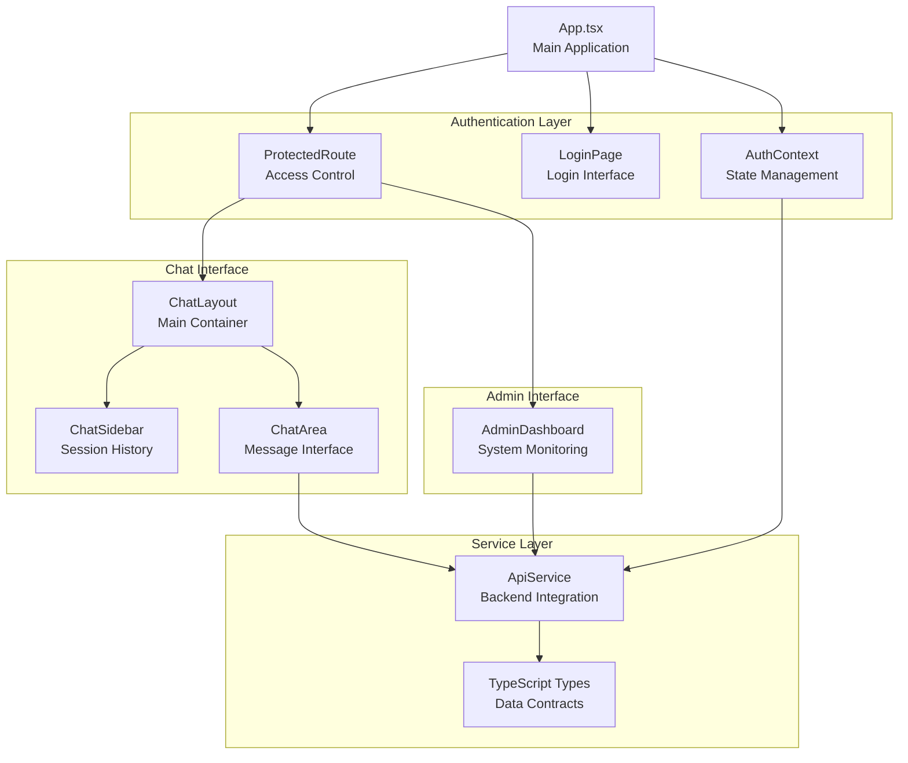

### 3. Separation of Concerns

The architecture clearly separates different responsibilities:

- **Presentation Layer**: React components handle UI rendering and user interactions
- **Business Logic Layer**: Custom hooks and context providers manage application state
- **Data Access Layer**: API service handles all backend communication
- **Type Safety Layer**: TypeScript interfaces ensure type safety across the application

### 4. State Management Strategy

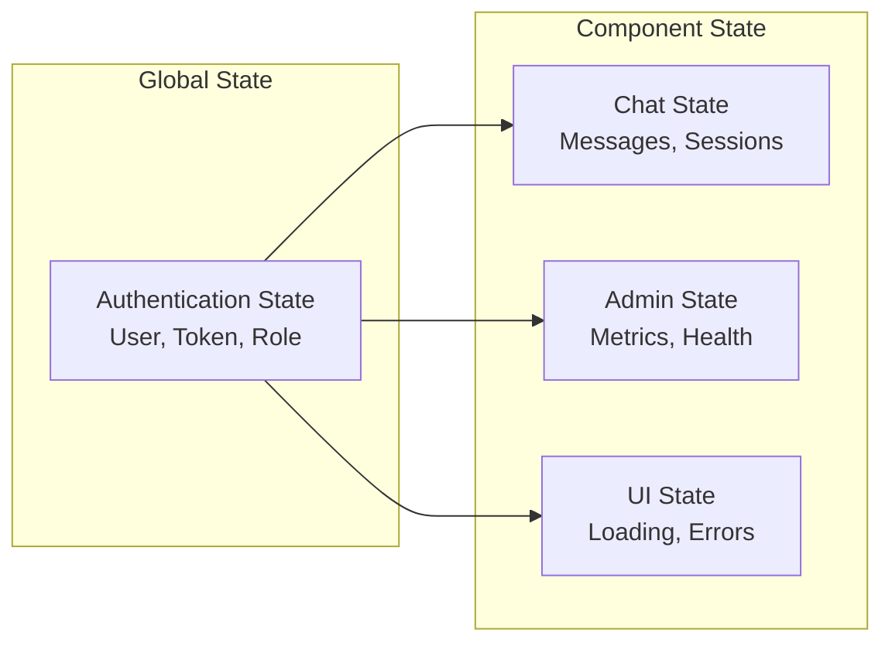

## Component Architecture

### Authentication System

#### AuthContext Provider

```typescript
interface AuthState {
  isAuthenticated: boolean;
  user: User | null;
  token: string | null;
}

interface AuthContextType {
  authState: AuthState;
  login: (email: string, password: string) => Promise<void>;
  logout: () => void;
}
```

**Design Principles:**
- **Single Source of Truth**: All authentication state managed in one place
- **Provider Pattern**: Context provides auth state to entire application
- **Immutable Updates**: State updates follow immutable patterns
- **Error Handling**: Comprehensive error handling for auth operations

#### Modular Authentication Design

The authentication system is designed for future extensibility:

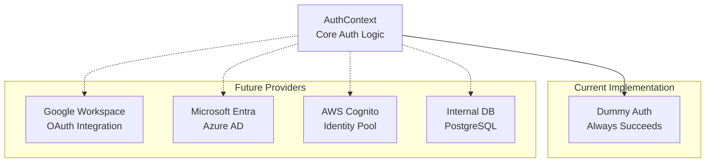

### Chat Interface Architecture

#### Component Hierarchy

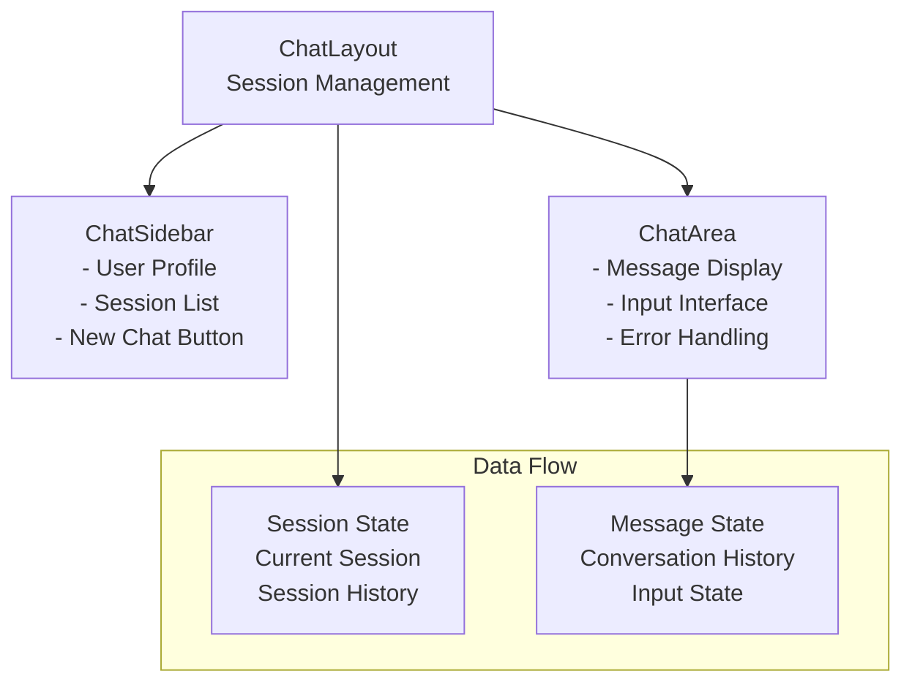

#### State Management Flow

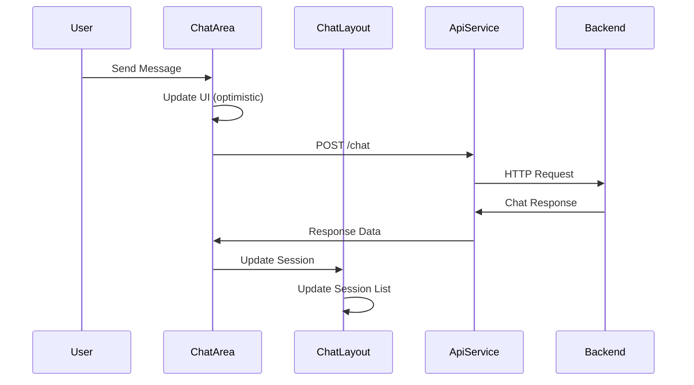

### Admin Dashboard Architecture

#### Metrics Management

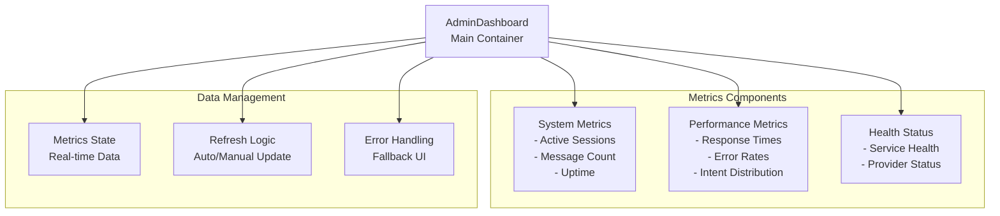

## Data Flow Architecture

### Request/Response Flow

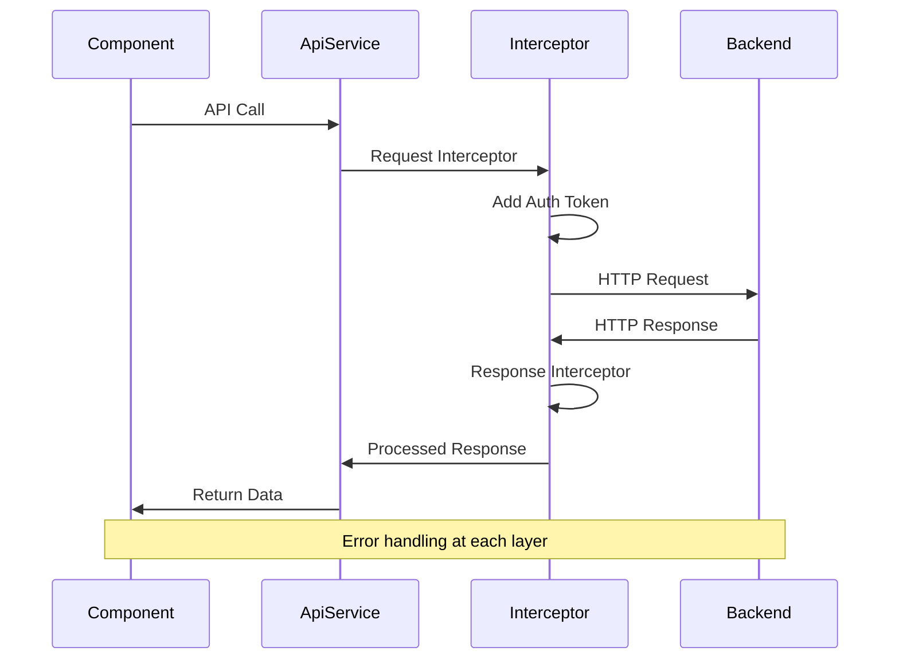

### Error Handling Strategy

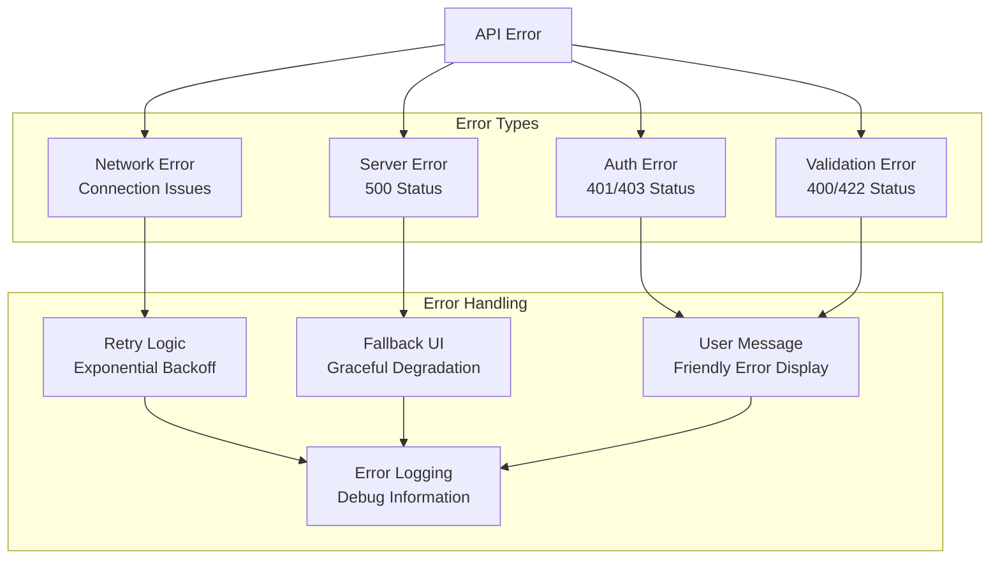

## Security Architecture

### Authentication Flow

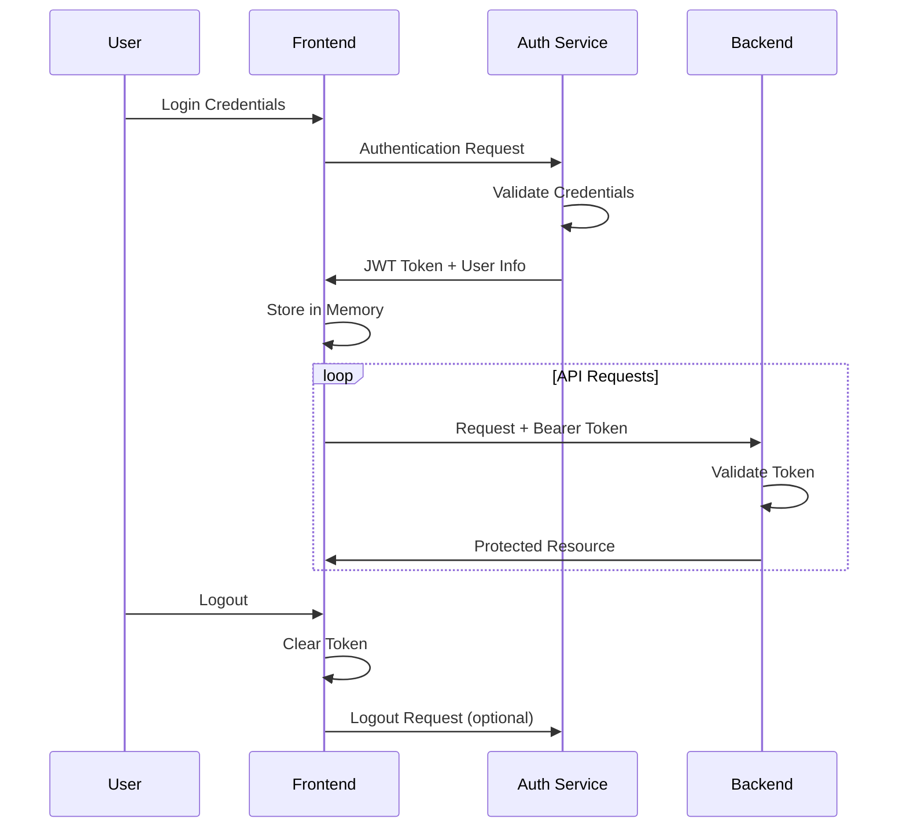

### Role-Based Access Control

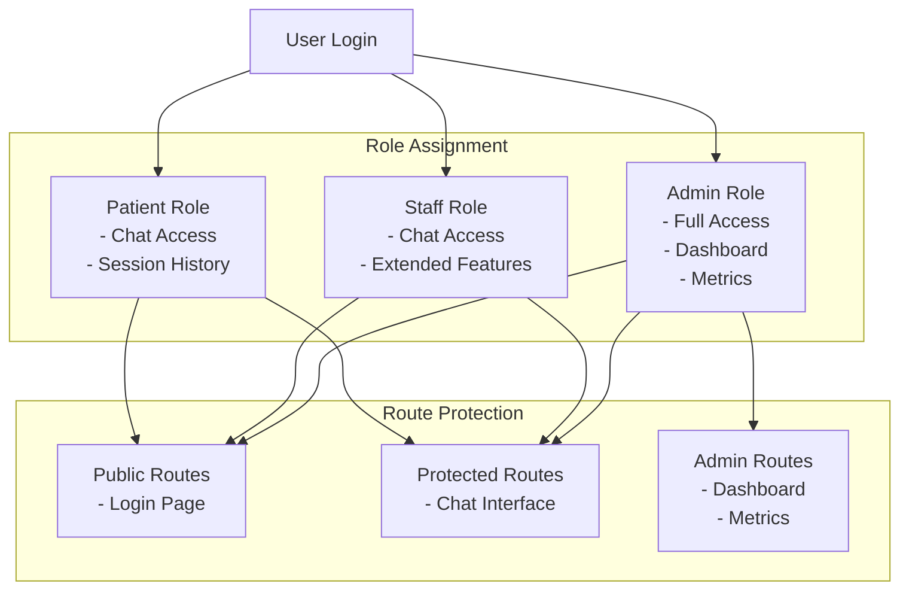

## Performance Architecture

### Code Splitting Strategy

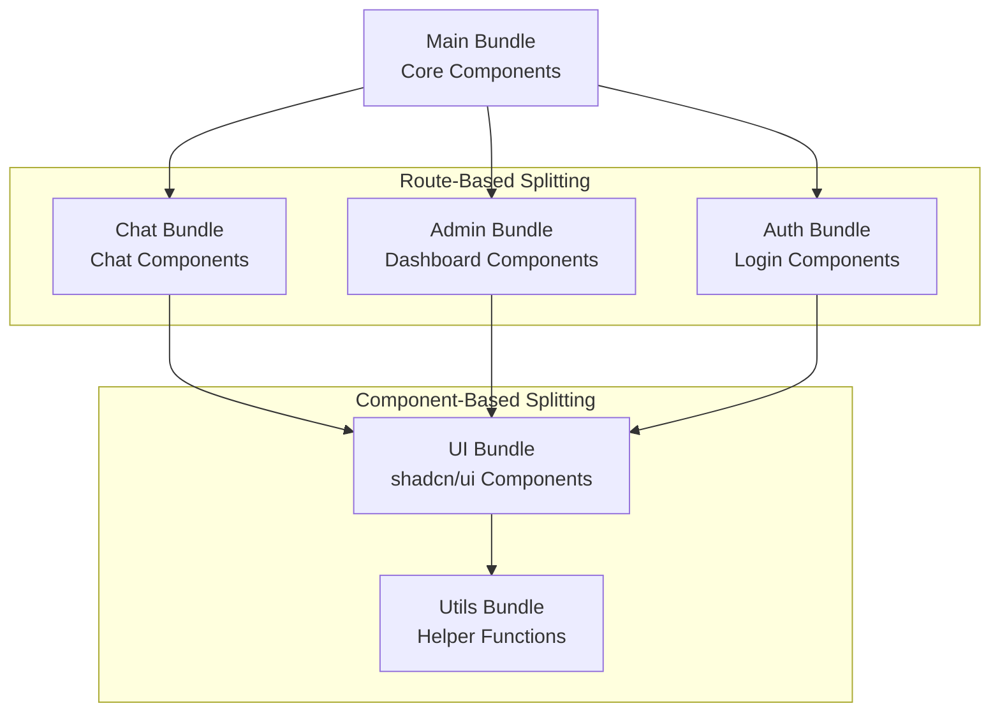

### Caching Strategy

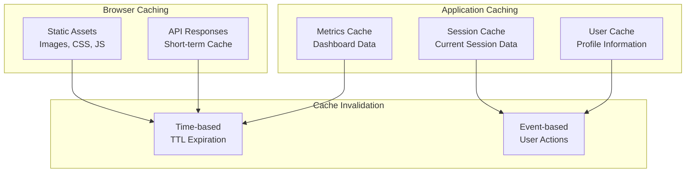

## Scalability Considerations

### Component Scalability

1. **Lazy Loading**: Components loaded on-demand
2. **Memoization**: React.memo for expensive components
3. **Virtual Scrolling**: For large message lists (future)
4. **Pagination**: For session history

### State Management Scalability

1. **Context Splitting**: Separate contexts for different domains
2. **Reducer Pattern**: For complex state updates
3. **Middleware**: For logging and debugging
4. **Persistence**: Local storage for offline capability

### API Scalability

1. **Request Batching**: Combine multiple requests
2. **Debouncing**: Reduce API call frequency
3. **Caching**: Reduce redundant requests
4. **Retry Logic**: Handle temporary failures

## Development Architecture

### Build System

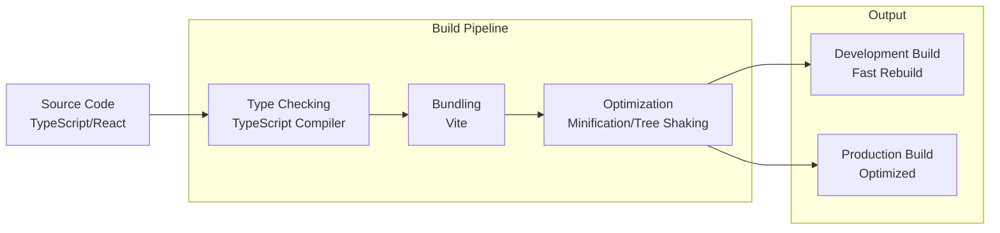

### Testing Architecture

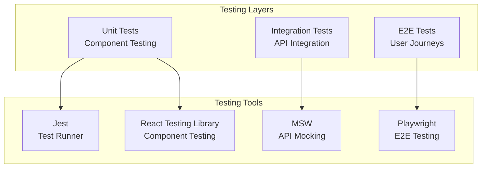

## Deployment Architecture

### Environment Strategy

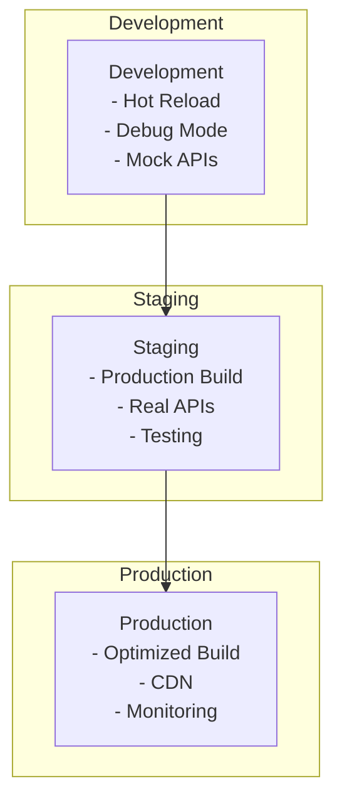

### Configuration Management

```typescript
// Environment-specific configuration
interface Config {
  apiUrl: string;
  authUrl: string;
  environment: 'development' | 'staging' | 'production';
  features: {
    debugMode: boolean;
    mockAuth: boolean;
    analytics: boolean;
  };
}
```

## Future Architecture Enhancements

### Planned Improvements

1. **Real-time Communication**
   - WebSocket integration for live chat
   - Server-sent events for notifications

2. **Offline Capability**
   - Service worker implementation
   - Local data persistence
   - Sync when online

3. **Micro-frontend Architecture**
   - Module federation
   - Independent deployments
   - Team autonomy

4. **Advanced State Management**
   - Redux Toolkit for complex state
   - RTK Query for data fetching
   - Optimistic updates

5. **Enhanced Security**
   - Content Security Policy
   - Subresource Integrity
   - Token refresh mechanism

### Monitoring and Observability

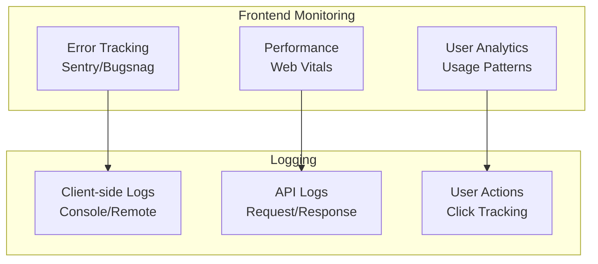

This architecture provides a solid foundation for the healthcare chatbot frontend while maintaining flexibility for future enhancements and integrations.
